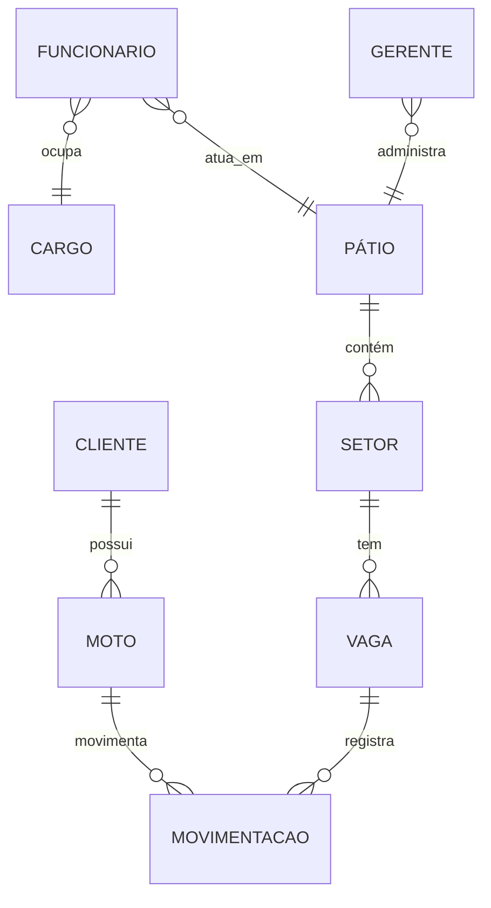
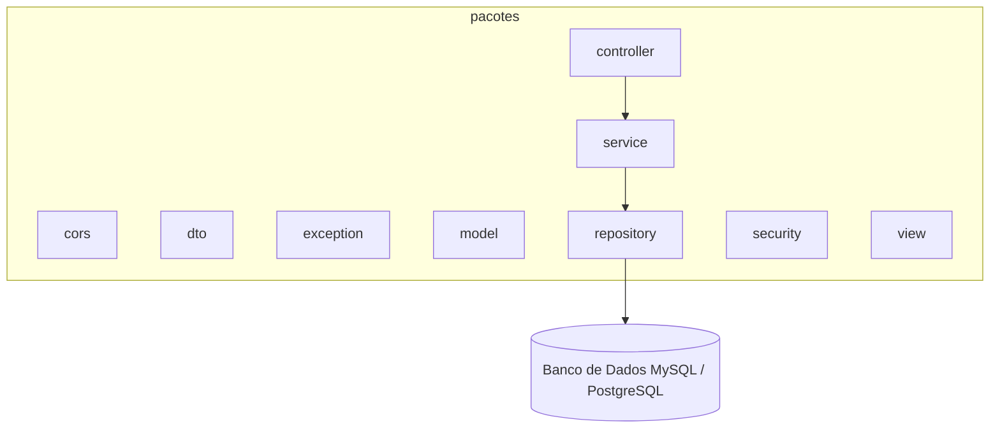
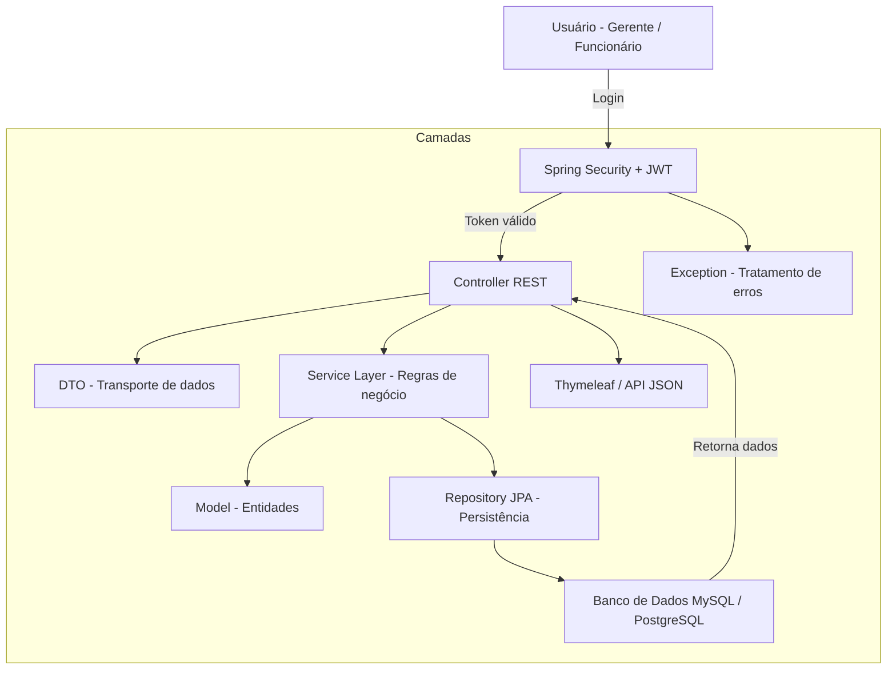
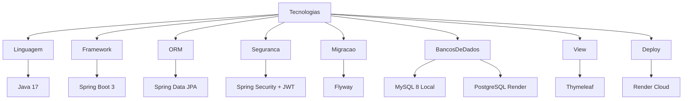
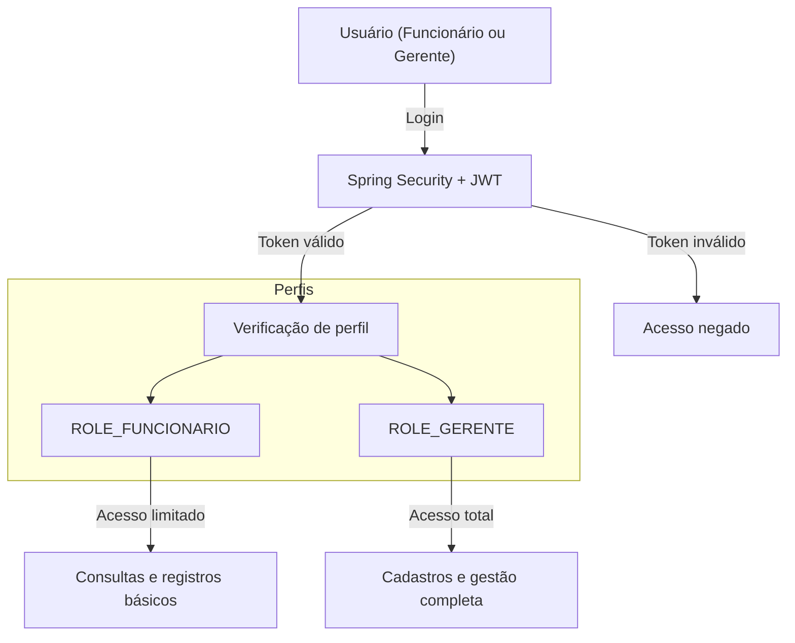

## Vídeo demonstracao do projeto 
## [VIDEO YOUTUBE](https://youtu.be/I6KXXwZDc_Y)


# Mottu Mottion

O **Mottu Mottion** é um sistema desenvolvido em **Java com Spring Boot**, criado para apoiar a **Mottu**, empresa especializada no aluguel de motos para entregadores.
O projeto tem como objetivo aprimorar a **gestão e o monitoramento da frota**, oferecendo uma plataforma **web moderna, segura e escalável**.

---

## Etiquetas

[]()
[]()
[]()
[]()
[]()
[]()

---

## Demonstração

Acesse a versão hospedada do projeto:

🔗 [https://sprint03-mottu-motion-java-adavanced-1.onrender.com](https://sprint03-mottu-motion-java-adavanced-1.onrender.com)

---

## Funcionalidades

* Cadastro e gerenciamento de motos, pátios, setores e vagas
* Registro de movimentações de entrada e saída de veículos
* Autenticação JWT com perfis de usuário

  * **ROLE_FUNCIONARIO**
  * **ROLE_GERENTE**
* Migração automática de banco de dados com Flyway
* API RESTful seguindo boas práticas e arquitetura em camadas
* Deploy automatizado em nuvem (Render)

---


## Deploy

O deploy é feito automaticamente via **Render**, utilizando **PostgreSQL Cloud**.

```bash
# Branch de deploy
git checkout sprint-4-render-migration

# Build do projeto
mvn clean install

# Deploy automático via Render
```

---

## Instalação

Clone o repositório e instale as dependências Maven.

```bash
git clone https://github.com/giovannarevitoroz/Sprint01-Mottu-Motion-Java-Adavanced.git
cd Sprint01-Mottu-Motion-Java-Adavanced
mvn install
```

---

## Rodando localmente

```bash
mvn spring-boot:run
```

Acesse: [http://localhost:8080/login](http://localhost:8080/login)

---

## Rodando os testes

Execute os testes automatizados com:

```bash
mvn test
```

Os testes validam endpoints, autenticação e persistência no banco via **JUnit**.

---

## Aprendizados

Durante o desenvolvimento do projeto, foram aplicados e consolidados diversos conceitos:

* Estruturação de API RESTful com **Spring Boot 3**
* Implementação de segurança com **Spring Security + JWT**
* Controle de versão e migração de banco via **Flyway**
* Integração contínua e deploy automatizado com **Render Cloud**
* Modelagem relacional com **Spring Data JPA** e diagramas ER
* Boas práticas de arquitetura em camadas (Controller, Service, Repository)

---

## Documentação da API

#### Retorna todas as motos

```http
  GET /api/motos
```

| Parâmetro       | Tipo     | Descrição                             |
| :-------------- | :------- | :------------------------------------ |
| `Authorization` | `string` | **Obrigatório**. Token JWT do usuário |

#### Retorna uma moto por ID

```http
  GET /api/motos/{id}
```

| Parâmetro | Tipo   | Descrição                                     |
| :-------- | :----- | :-------------------------------------------- |
| `id`      | `long` | **Obrigatório**. ID da moto que deseja buscar |

#### Cadastra uma nova moto

```http
  POST /api/motos
```

| Campo                | Tipo     | Descrição            |
| -------------------- | -------- | -------------------- |
| `placa_moto`         | `string` | Placa da moto        |
| `modelo_moto`        | `string` | Modelo da moto       |
| `cliente_id_cliente` | `long`   | Cliente proprietário |

---

## Roadmap

* [ ] Adicionar painel de dashboard com gráficos de movimentação
* [ ] Expandir autenticação para integração mobile
---

## Estrutura do Projeto

```
mottu-mottion/
│
├── src/main/java/com/mottu/mottion/
│   ├── controller/        # Endpoints REST
│   ├── service/           # Regras de negócio
│   ├── repository/        # Persistência JPA
│   ├── model/             # Entidades
│   ├── dto/               # Transporte de dados
│   ├── security/          # Configuração JWT
│   ├── exception/         # Tratamento de erros
│   └── MottuMottion.java  # Classe principal
│
├── src/main/resources/
│   ├── db/migration/      # Scripts Flyway
│   ├── templates/         # Páginas Thymeleaf
│   └── application.properties
│
└── pom.xml                # Dependências Maven
```

---

## Modelo Relacional (Mermaid)



## Pacotes da Aplicação



## Fluxo da Aplicação

---

## Tecnologias Utilizadas


## Autenticação


## Referências

* [Spring Boot Documentation](https://spring.io/projects/spring-boot)
* [Flyway Documentation](https://flywaydb.org/documentation/)
* [Spring Security JWT](https://spring.io/guides/tutorials/spring-boot-oauth2/)
* [Render Deploy Docs](https://render.com/docs)

## Authors

* Giovanna Revito Roz – RM558981
* Kaian Gustavo de Oliveira Nascimento – RM558986
* Lucas Kenji Kikuchi – RM554424


